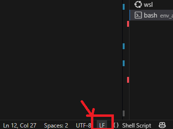
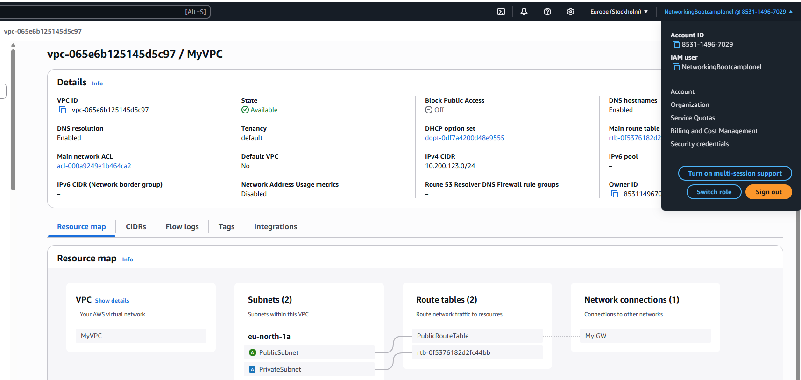

## AWS CLI setup

https://docs.aws.amazon.com/cli/latest/userguide/getting-started-install.html
In order to use the AWS CLI with VS Code, I've setup a new IAM role for this bootcamp, with its own Access Key and Secret. 
Installed AWS CLI on my Win machine and configured it in VSCode (acces key, secret key, region):
```sh
aws configure
```
## VPC Settings
VPC Settings for AWS (Tim)

- VPC IPv4 CIDR block: 10.200.123.0/24
- IPv6 CIDR block: none
- Number of AZs: 1
- Number of public subnets: 1
- Number of private subnets: 1
- NAT Gateways: None
- VPC Endpoints: None
- DNS Options: Enable DNS Hostnames
- DNS Options: Enable DNS Resolution

## Generated and Review CFN Template

Based on the video instructions, I've extracted the VPC settings and provided them to an LLM to produce the CFN template, to automate the  provision of the VPC infrastructure.

CloudFormation does not allow intrinsic functions like !Select in a Default value so don't specify the AZ (!Select, !GetAZs) in the yaml template.

## Generated Deploy Script

Using ChatGPT I've generated the bash script `bin/deploy`.

***End of line sequence must be set to LF (Unix line endings)***

Select the script file and check in the bottom right corner:


## Vizualization with Infrastructure Composer (AWS toolkit extension)

A simplistic representation:


## CloudFormation deployment

After succesfully deploying the CFN template, we have our VPC ready. 

