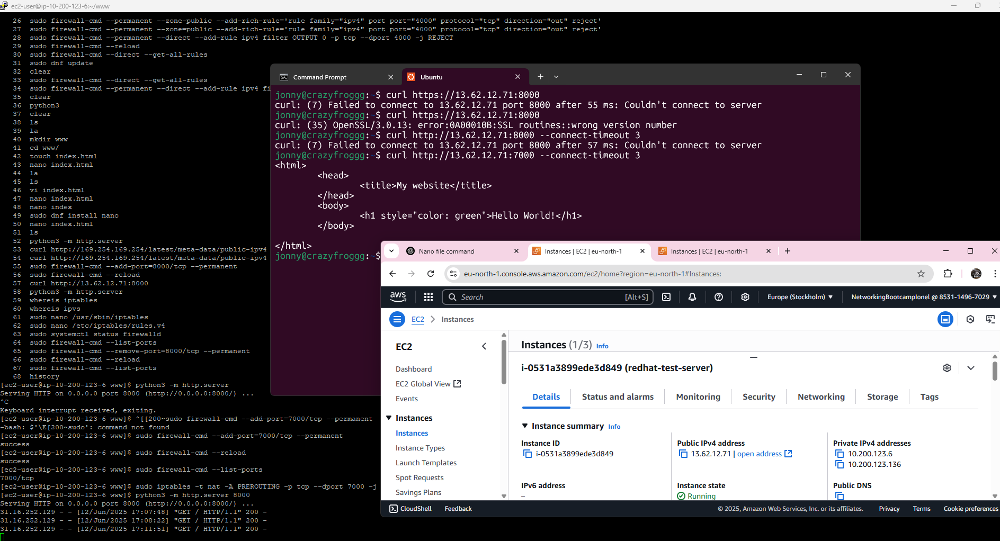

## Linux Firewall Rules

- I've decided to test how easy is to manage firewall rules on Redhat.
- on Redhat the firewall is called `firewalld`

## Process

- created a new folder, with a static webpage
- started the python server
```
python3 -m http.server 8000
```
- we already had port 8000 opened in the inbound rules for the security group
- added port 8000 to the list of allowed ports: 
```
sudo firewall-cmd --add-port=8000/tcp --permanent
```
- restarted the firewall, for changes to take effect: 
```
sudo firewall-cmd --reload
```
- successfully pinged the server from my local machine
- added port 7000 also, to the inbound rules from the security group in AWS, for this Redhat server
- added port 7000 as allowed port, on the firewall list inside the Redhat server: 
```
sudo firewall-cmd --add-port=7000/tcp --permanent
```
- we removed port 8000 from the list: 
```
sudo firewall-cmd --remove-port=8000/tcp --permanent
sudo firewall-cmd --reload
```
- we can test what open ports we have. We should only see port 7000:
```
sudo firewall-cmd --list-ports
```
- in order to redirect traffic from port 7000 to 8000, we make use of the `iptables`:
```sh
sudo iptables -t nat -A PREROUTING -p tcp --dport 7000 -j REDIRECT --to-port 8000
```
- we run again the python server
- now we can curl from our local machine into it, using port 7000:
```
curl http://<your-ec2-ip>:7000
```
- in the following image we can see the 2 attempts to ping from my local machine, once using port 8000- and failing- and once using port 7000, with success:
