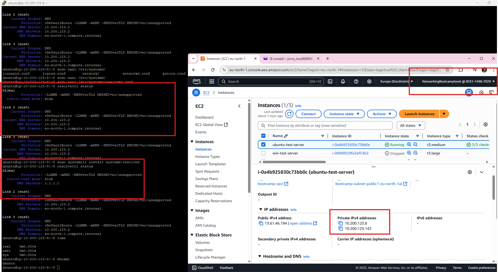
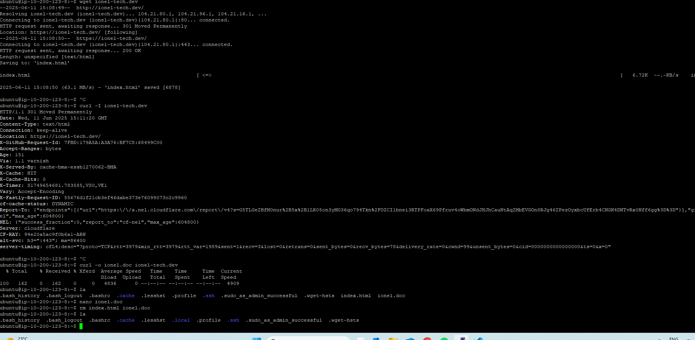

## Resolver 
- by editing the file `resolved.conf` from `/etc/systemd/`  we can change different parameters for apps, DNS settings and others
- the command for this: `~$ sudo nano /etc/systemd/resolved.conf`
- in our case we edited the `DNS=1.1.1.1`
- as shown in the picture, the first `resolvectl status` command returned no changes, because we didn't restarted the resolver
- after restarting the resolver with the command `~$ sudo systemctl restart systemd-resolved`, we see the changes taking effect:



## wget vs cURL

They're both Linux commands, used to retrieve data, but `wget` is better suited for webpages and websites (supports HTTP, HTTPS, FTP protocols) and `cURL` is designed for all kinds of remote file transfers, supporting more features and protocols (26, including SCP, SFTP, etc).

***wget:***
- I've used this command for a website of mine, and it downloaded it into `index.html` file
```sh
ubuntu@ip-10-200-123-8:~$ wget ionel-tech.dev
--2025-06-11 15:08:49--  http://ionel-tech.dev/
Resolving ionel-tech.dev (ionel-tech.dev)... 104.21.80.1, 104.21.96.1, 104.21.16.1, ...
Connecting to ionel-tech.dev (ionel-tech.dev)|104.21.80.1|:80... connected.
HTTP request sent, awaiting response... 301 Moved Permanently
Location: https://ionel-tech.dev/ [following]
--2025-06-11 15:08:50--  https://ionel-tech.dev/
Connecting to ionel-tech.dev (ionel-tech.dev)|104.21.80.1|:443... connected.
HTTP request sent, awaiting response... 200 OK
Length: unspecified [text/html]
Saving to: ‘index.html’

index.html                                                      [ <=>                                                                                                                                     ]   6.72K  --.-KB/s    in 0s

```

***cURL:***
- by using the `curl -I ionel-tech.dev` command, we get the header for this webpage
- if we want to save it, like we did with `wget`, we can specify the document name, using `-o` flag
```sh
ubuntu@ip-10-200-123-8:~$ curl -I ionel-tech.dev
HTTP/1.1 301 Moved Permanently
Date: Wed, 11 Jun 2025 15:11:20 GMT
Content-Type: text/html
Connection: keep-alive
Location: https://ionel-tech.dev/
X-GitHub-Request-Id: 7FBD:179A5A:A3A76:BF7C8:68499C00
Accept-Ranges: bytes
Age: 151
Via: 1.1 varnish
X-Served-By: cache-bma-essb1270062-BMA
X-Cache: HIT
X-Cache-Hits: 0
X-Timer: S1749654681.783585,VS0,VE1
Vary: Accept-Encoding
X-Fastly-Request-ID: 55676d1f21cb3ef46dabe373e76099073c2c9960
cf-cache-status: DYNAMIC
Report-To: {"endpoints":[{"url":"https:\/\/a.nel.cloudflare.com\/report\/v4?s=G5TLGeZBfM0nur%2B5x%2B1LR05on3yMO36qo794Tkn%2FOZCI1bnei3RTPFoaX69Pfruv4oWbmONdJHJhCauNtAqZMbEVGOn8RJg46ZPezOyxbcUfErb4CNGN4DNTvRx0Nff6gg%3D%3D"}],"group":"cf-nel","max_age":604800}
NEL: {"success_fraction":0,"report_to":"cf-nel","max_age":604800}
Server: cloudflare
CF-RAY: 94e20a5ac9f0b6a1-ARN
alt-svc: h3=":443"; ma=86400
server-timing: cfL4;desc="?proto=TCP&rtt=3979&min_rtt=3979&rtt_var=1989&sent=1&recv=3&lost=0&retrans=0&sent_bytes=0&recv_bytes=78&delivery_rate=0&cwnd=99&unsent_bytes=0&cid=0000000000000000&ts=0&x=0"

```
- here we can see the results of both commands, in the Linux CLI



***Conclusion:*** `wget` is best used for downloading webpages and websites, `curl` for the rest.