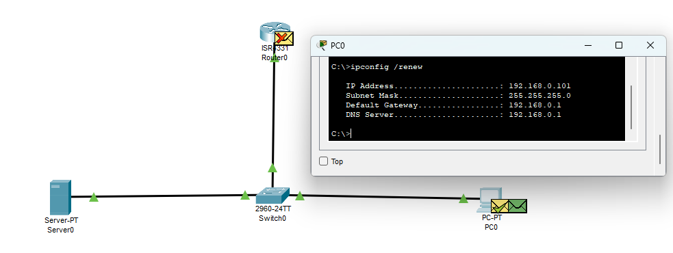

## Simulating a network with CISCO Packet Tracer

Packet Tracer is a usefull simulation tool, with some limitations, provided by CISCO. 

Our demo lab consists of a simple network, with the following components:
- router: we set a static IP addr (to be always available) and we turn it on (no shutdown);
- server: our DHCP server, we need to configure it (default gateway and DNS server is the router). 
- switch
- end device (PC)

The first thing we attempt to do is configure the PC to receive an IP address (ipconfig /renew) because it doesn't have any, at the begining.

We can closely follow each stage of this process:
- PC sends a broadcast packet (Layer 3)
- switch sends the packet it receives to all other active ports
- router discards it (not listening on UDP port 68)
- server is listening (UDP port 67)
- server sends an ARP broadcast (Address Resolution Protocol) to all devices on LAN, to find the MAC addres of the device for a certain IP addr
- after it receives the response from PC, it will allocate the IP addr to it
