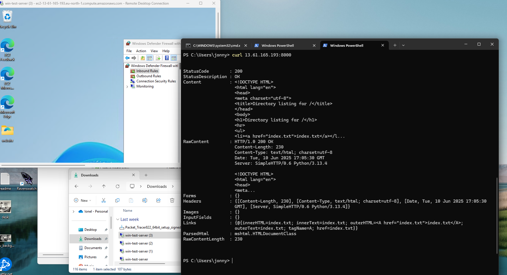

## Firewall rules

In order to test how firewall works, I've decided to use a Windows virtual machine (AWS). 

- started a web server using Python, to serve a static single page.
- the firewall rules block everything that does not have an inbound rule.
- created an inbound rule for port 8000, in the Windows VM firewall.
- added a rule at the security group for this Win machine, in AWS, to open port 8000.
- now I was able to use curl into the server, also opened it from browser, on my local machine.

