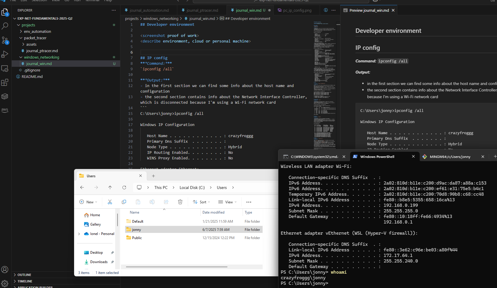

## Developer environment

<screenshot proof of work>
<describe environment, cloud or personal machine>

- for this part I've decided to work on my personal computer, not the cloud one. 



## IP config
***Command:*** 
`ipconfig /all`

***Output:***
- in the first section we can find some info about the host name and configuration
- the second section contains info about the Network Interface Controller, which is disconnected because I'm using a Wi-Fi network card
```
C:\Users\jonny>ipconfig /all

Windows IP Configuration

   Host Name . . . . . . . . . . . . : crazyfroggg
   Primary Dns Suffix  . . . . . . . :
   Node Type . . . . . . . . . . . . : Hybrid
   IP Routing Enabled. . . . . . . . : No
   WINS Proxy Enabled. . . . . . . . : No

Ethernet adapter Ethernet:

   Media State . . . . . . . . . . . : Media disconnected
   Connection-specific DNS Suffix  . :
   Description . . . . . . . . . . . : Realtek Gaming 2.5GbE Family Controller
   Physical Address. . . . . . . . . : 34-5A-60-01-E6-69
   DHCP Enabled. . . . . . . . . . . : Yes
   Autoconfiguration Enabled . . . . : Yes
```
- here we can see the Wi-Fi card
- Dynamic Host Configuration Protocol (DHCP) is enabled, which means my IP is auto-assigned, inside my network.
- the DHCP server has its own IP address (set up in my router)
- we can also observe the lease period for the IP addreses, the DHCP server refreshes them
- the DHCP server is also the Default Gateway and DNS server for my network, as that's usually the case in a home network
```
Wireless LAN adapter Wi-Fi:

   Connection-specific DNS Suffix  . :
   Description . . . . . . . . . . . : RZ616 Wi-Fi 6E 160MHz
   Physical Address. . . . . . . . . : 78-46-5C-C4-00-DB
   DHCP Enabled. . . . . . . . . . . : Yes
   Autoconfiguration Enabled . . . . : Yes
   IPv6 Address. . . . . . . . . . . : 2a02:810d:b11e:c200:d9ac:da87:a88a:c153(Preferred)
   Lease Obtained. . . . . . . . . . : Monday, June 9, 2025 2:32:08 PM
   Lease Expires . . . . . . . . . . : Monday, June 16, 2025 2:32:08 PM
   IPv6 Address. . . . . . . . . . . : 2a02:810d:b11e:c200:ef61:e31:75e5:b4c1(Preferred)
   Temporary IPv6 Address. . . . . . : 2a02:810d:b11e:c200:70d8:90b8:c68:cc48(Preferred)
   Link-local IPv6 Address . . . . . : fe80::b8e5:5355:658:16ca%13(Preferred)
   IPv4 Address. . . . . . . . . . . : 192.168.0.199(Preferred)
   Subnet Mask . . . . . . . . . . . : 255.255.255.0
   Lease Obtained. . . . . . . . . . : Saturday, June 7, 2025 12:49:32 PM
   Lease Expires . . . . . . . . . . : Monday, June 16, 2025 2:27:07 PM
   Default Gateway . . . . . . . . . : fe80::10:18ff:fe66:4934%13
                                       192.168.0.1
   DHCP Server . . . . . . . . . . . : 192.168.0.1
   DHCPv6 IAID . . . . . . . . . . . : 410535516
   DHCPv6 Client DUID. . . . . . . . : 00-01-00-01-2E-F1-4E-6E-34-5A-60-01-E6-69
   DNS Servers . . . . . . . . . . . : 2a02:810d:b11e:c200:10:18ff:fe66:4934
                                       192.168.0.1
                                       2a02:810d:b11e:c200:10:18ff:fe66:4934
   NetBIOS over Tcpip. . . . . . . . : Enabled
```
- here we can see my virtual network interface, created by Windows Subsystem for Linux (WSL).
- allows communication between the WSL environment and the Windows host.
- it is managed through Hyper-V, which provides firewall capabilities to filter network traffic for containers and virtual machines.
- the IP is set from an internal range, not visible to the router.
```
Ethernet adapter vEthernet (WSL (Hyper-V firewall)):

   Connection-specific DNS Suffix  . :
   Description . . . . . . . . . . . : Hyper-V Virtual Ethernet Adapter
   Physical Address. . . . . . . . . : 00-15-5D-2D-A7-E8
   DHCP Enabled. . . . . . . . . . . : No
   Autoconfiguration Enabled . . . . : Yes
   Link-local IPv6 Address . . . . . : fe80::3e62:c96e:be03:a80f%44(Preferred)
   IPv4 Address. . . . . . . . . . . : 172.17.64.1(Preferred)
   Subnet Mask . . . . . . . . . . . : 255.255.240.0
   Default Gateway . . . . . . . . . :
   DHCPv6 IAID . . . . . . . . . . . : 738202973
   DHCPv6 Client DUID. . . . . . . . : 00-01-00-01-2E-F1-4E-6E-34-5A-60-01-E6-69
   NetBIOS over Tcpip. . . . . . . . : Enabled
```
## Ping

***Command:*** `ping -4 www.google.com`

***Output:***
- firstly, the system resolves the domain name into an IP address, using DNS
- the system sends an ICMP (Internet Control Message Protocol) Echo Request packet to the IP address
- if the destination is online and reachable, it sends back an ICMP Echo Reply.
- the total time from sending the request until receiving the response is called RTT (Round-Trip Time)
- the flag `-4` helps us to test only the IPv4 connection
```
C:\Users\jonny>ping -4 www.google.com

Pinging www.google.com [142.251.37.4] with 32 bytes of data:
Reply from 142.251.37.4: bytes=32 time=33ms TTL=114
Reply from 142.251.37.4: bytes=32 time=39ms TTL=114
Reply from 142.251.37.4: bytes=32 time=37ms TTL=114
Reply from 142.251.37.4: bytes=32 time=35ms TTL=114

Ping statistics for 142.251.37.4:
    Packets: Sent = 4, Received = 4, Lost = 0 (0% loss),
Approximate round trip times in milli-seconds:
    Minimum = 33ms, Maximum = 39ms, Average = 36ms
```

## Trace route
***Command:*** `tracert`

***Output:***
- I've tried to see the hops between my computer and a destination website, youtube in this case.
- from the first line we can see that youtube is a service provided by google, so it routes us to one of its IP addresses
```
C:\Users\jonny>tracert -4 www.youtube.com

Tracing route to youtube-ui.l.google.com [142.251.37.14]
over a maximum of 30 hops:

  1     9 ms     7 ms    10 ms  kabelbox [192.168.0.1]
  2    24 ms    28 ms    22 ms  ip53a9b77a.static.kabel-deutschland.de [83.169.183.122]
  3    34 ms    30 ms    33 ms  ip5886ea4b.static.kabel-deutschland.de [88.134.234.75]
  4    24 ms    23 ms    67 ms  145.254.3.60
  5    29 ms    32 ms    27 ms  145.254.2.175
  6    29 ms    24 ms    38 ms  72.14.195.160
  7    35 ms    29 ms    36 ms  192.178.105.195
  8    33 ms    28 ms    28 ms  108.170.228.45
  9    24 ms    30 ms    34 ms  muc11s23-in-f14.1e100.net [142.251.37.14]

Trace complete.
```

## Netstat
***Command:*** `netstat`

***Output:***
- we can observe the active connections to my machine.
- the protocol type is TCP (Transmission Control Protocol), a reliable, ordered, error checked protocol.
- there are local connections, between different processes (IP addresses 127.x.x.x) as well as connections to the router, for different outside locations (both IPv4 and IPv6)
```
C:\Users\jonny>netstat

Active Connections

  Proto  Local Address          Foreign Address        State
  TCP    127.0.0.1:56829        crazyfroggg:65267      ESTABLISHED
  TCP    127.0.0.1:65191        crazyfroggg:65215      ESTABLISHED
...
  TCP    192.168.0.199:27036    DESKTOP-8B6UTB2:52119  ESTABLISHED
  TCP    192.168.0.199:49732    ec2-3-231-142-222:https  ESTABLISHED
  TCP    192.168.0.199:49812    155.133.248.42:27018   ESTABLISHED
  TCP    192.168.0.199:49832    a23-197-130-99:https   ESTABLISHED
  TCP    192.168.0.199:50714    52.182.143.210:https   TIME_WAIT
  TCP    192.168.0.199:50716    13.69.109.130:https    TIME_WAIT
  TCP    192.168.0.199:50718    kabelbox:domain        TIME_WAIT
  TCP    192.168.0.199:50719    kabelbox:domain        TIME_WAIT
...
  TCP    [2a02:810d:b11e:c200:70d8:90b8:c68:cc48]:50712  g2a02-26f0-2780-0006-0000-0000-0214-f58b:https  CLOSE_WAIT
  TCP    [2a02:810d:b11e:c200:70d8:90b8:c68:cc48]:50717  [2600:9000:237d:fe00:18:186a:1ac0:93a1]:https  TIME_WAIT
  TCP    [2a02:810d:b11e:c200:70d8:90b8:c68:cc48]:50721  [2600:9000:237d:be00:18:186a:1ac0:93a1]:https  TIME_WAIT
  TCP    [2a02:810d:b11e:c200:70d8:90b8:c68:cc48]:65179  [2600:9000:2165:600:c:cfd4:a580:93a1]:https  ESTABLISHED
```
## Route
***Command:*** `route print -4`

***Output:***
- the `route` command with the `print` flag helps us see the routing tables, `-4` flag = only for IPv4.
- in the first table we can observe the interface list, we've discussed them previously with the `ipconfig all` output.
- in the routing table we can observe different network connections.
- for each entry we have a network destination, subnet mask, gateway, interface and metric.
- the first entry is a very important one, tells us how the computer (192.168.0.199) knows how to access the internet — it sends everything to the router (192.168.0.1), which forwards it accordingly.
- we have no persistent routes, but they can be set in case it is required (very specific cases, to have the same route even after system shutdown).
```
C:\Users\jonny>route print -4
===========================================================================
Interface List
  5...34 5a 60 01 e6 69 ......Realtek Gaming 2.5GbE Family Controller
  9...7a 46 5c c4 20 fb ......Microsoft Wi-Fi Direct Virtual Adapter
  3...7a 46 5c c4 30 eb ......Microsoft Wi-Fi Direct Virtual Adapter #2
 13...78 46 5c c4 00 db ......RZ616 Wi-Fi 6E 160MHz
  1...........................Software Loopback Interface 1
 44...00 15 5d 2d a7 e8 ......Hyper-V Virtual Ethernet Adapter
===========================================================================

IPv4 Route Table
===========================================================================
Active Routes:
Network Destination        Netmask          Gateway       Interface  Metric
          0.0.0.0          0.0.0.0      192.168.0.1    192.168.0.199     35
        127.0.0.0        255.0.0.0         On-link         127.0.0.1    331
        127.0.0.1  255.255.255.255         On-link         127.0.0.1    331
  127.255.255.255  255.255.255.255         On-link         127.0.0.1    331
      172.17.64.0    255.255.240.0         On-link       172.17.64.1   5256
      172.17.64.1  255.255.255.255         On-link       172.17.64.1   5256
    172.17.79.255  255.255.255.255         On-link       172.17.64.1   5256
      192.168.0.0    255.255.255.0         On-link     192.168.0.199    291
    192.168.0.199  255.255.255.255         On-link     192.168.0.199    291
    192.168.0.255  255.255.255.255         On-link     192.168.0.199    291
        224.0.0.0        240.0.0.0         On-link         127.0.0.1    331
        224.0.0.0        240.0.0.0         On-link       172.17.64.1   5256
        224.0.0.0        240.0.0.0         On-link     192.168.0.199    291
  255.255.255.255  255.255.255.255         On-link         127.0.0.1    331
  255.255.255.255  255.255.255.255         On-link       172.17.64.1   5256
  255.255.255.255  255.255.255.255         On-link     192.168.0.199    291
===========================================================================
Persistent Routes:
  None
```